# 🚨 Crisis Match (Sahayak Setu)

**Offline-first emergency response system that connects victims to the nearest responders — even without internet.**

> Built at HackIndia Spark 6 @ NIT Delhi by **Team Routers**

---

## ⚡ Problem

In real emergencies, **help exists — but coordination fails**.

- Kerala Floods (2018): Boats available, but victims unreachable  
- Punjab Floods (2023): Rescue delays despite resources  
- Existing systems suffer from:
  - ❌ Internet dependency  
  - ❌ Centralized bottlenecks (112/911 overload)  
  - ❌ No real-time routing  
  - ❌ Poor accessibility during distress  

---

## 💡 Solution

**Crisis Match** is a **decentralized emergency orchestration platform** that:

- 📡 Works **without internet (SMS fallback)**
- 🧭 Matches victims with **nearest verified helpers**
- 🎙️ Enables **hands-free SOS (voice trigger)**
- 🔗 Logs rescue actions on **blockchain for trust**

---

## 🧩 Core Features

### 🚨 Offline SOS (Zero Connectivity)
- Detects network failure automatically  
- Sends **GPS + priority via SMS**  
- Guaranteed delivery using native telephony  

---

### 🗺️ Smart Routing Engine
- Matches victim ↔ nearest helper  
- Uses:
  - 📍 Geo queries (PostGIS)
  - ⏱️ Priority + wait-time logic  

---

### 🎙️ Voice-Activated Emergency
- Trigger SOS without touching phone  
- Real-time speech-to-text pipeline  

---

### 👥 Tri-Portal Ecosystem
- **Victim App** → Trigger SOS, track help  
- **Helper App** → Accept & navigate incidents  
- **Admin Dashboard** → Monitor system  

---

### 🔗 Blockchain Trust Layer
- Every rescue stored immutably  
- Builds **verifiable responder reputation**

---

## 📱 Application Screens

### 👤 Victim Portal
<p align="center">
  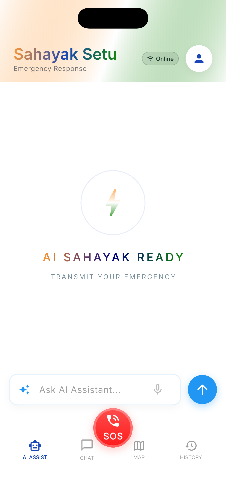
  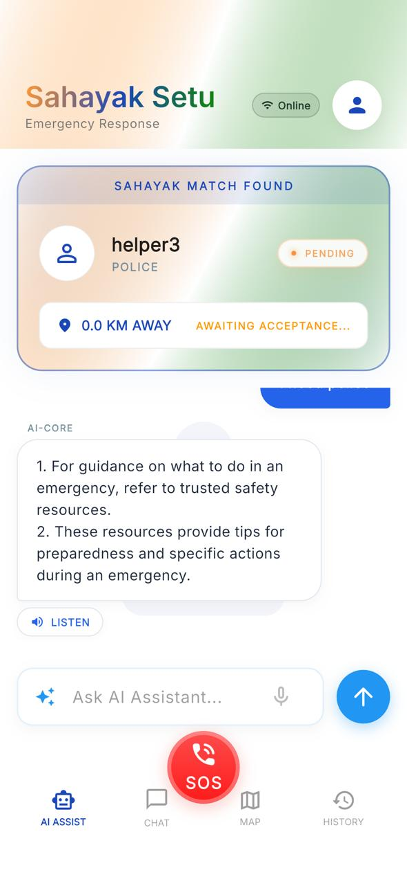
  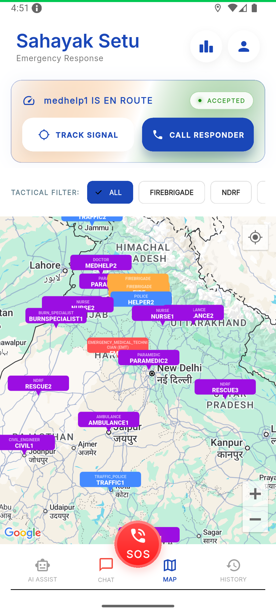
  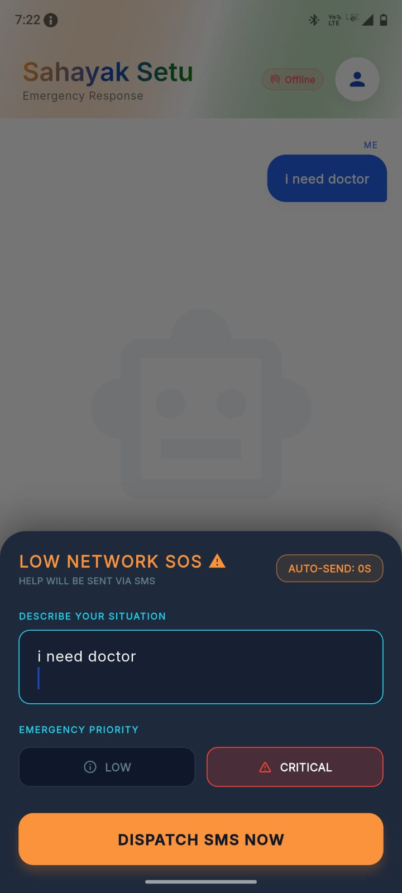
</p>

---

### 🧑‍🚒 Helper Portal
<p align="center">
  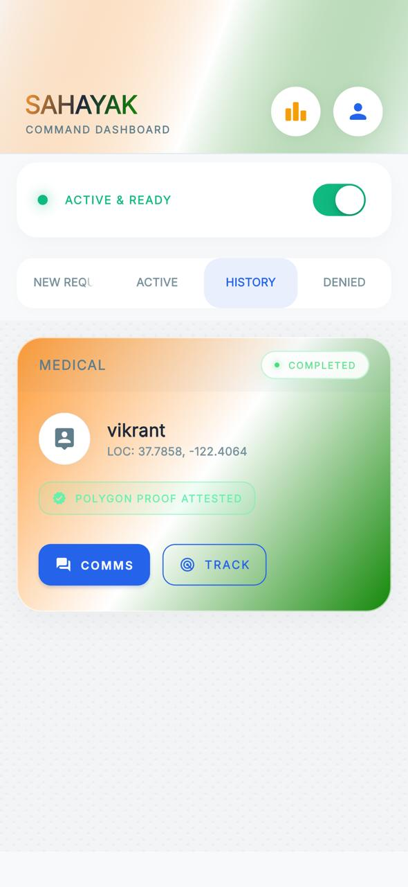
  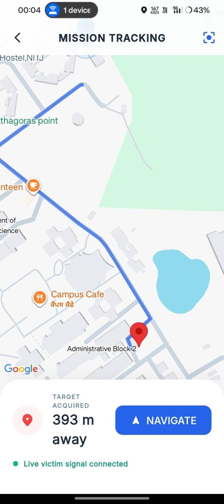
  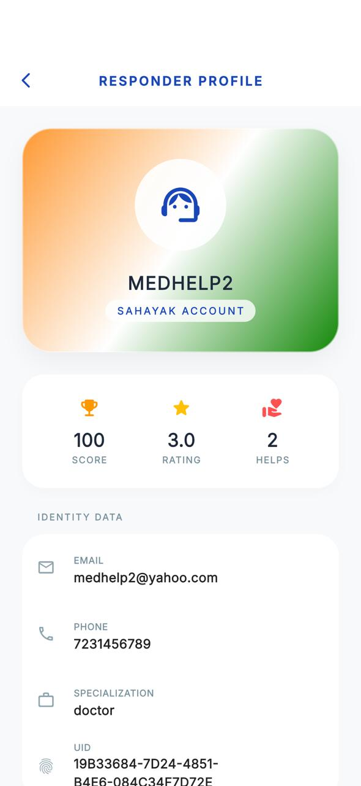
  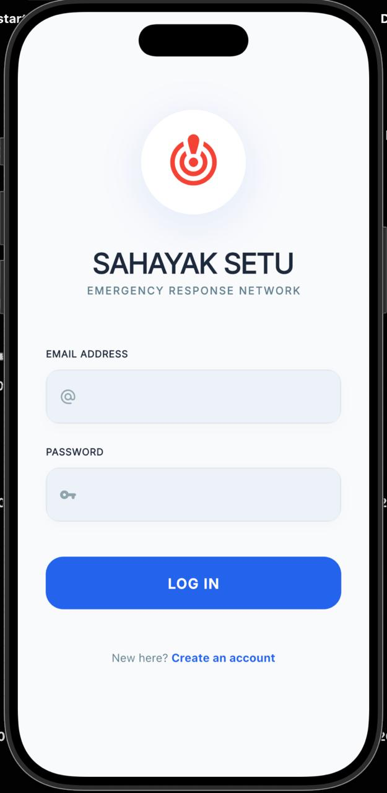
</p>

---

### 🛠️ Admin Dashboard
<p align="center">
  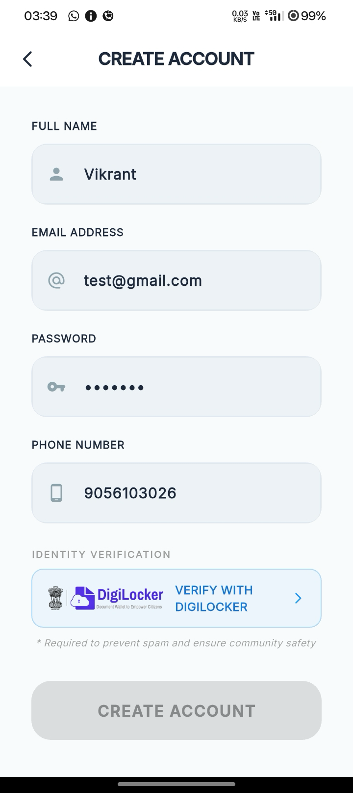
  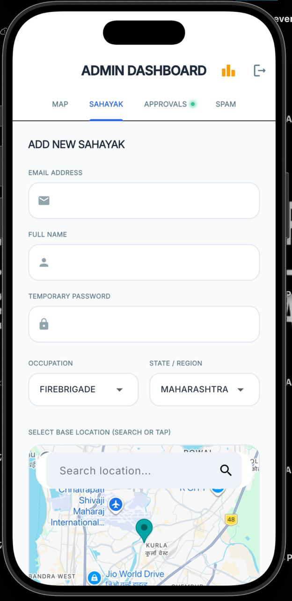
  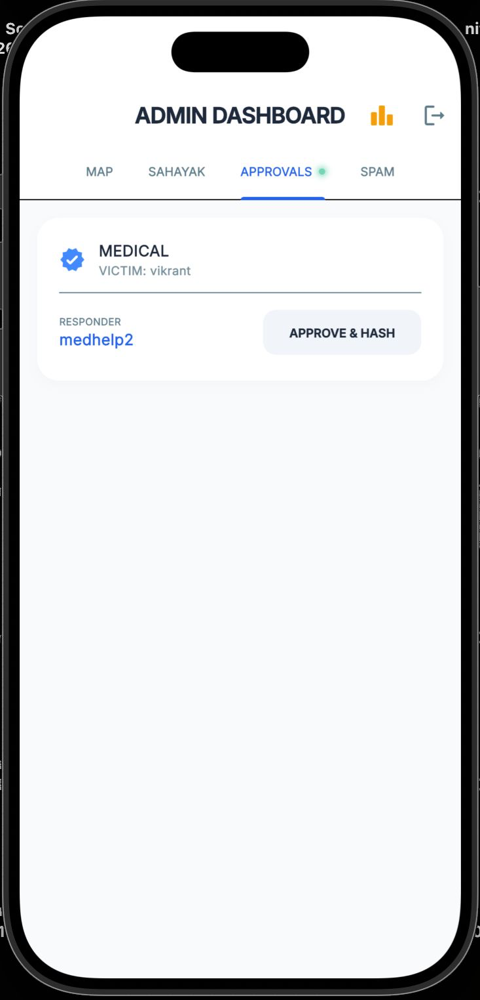
  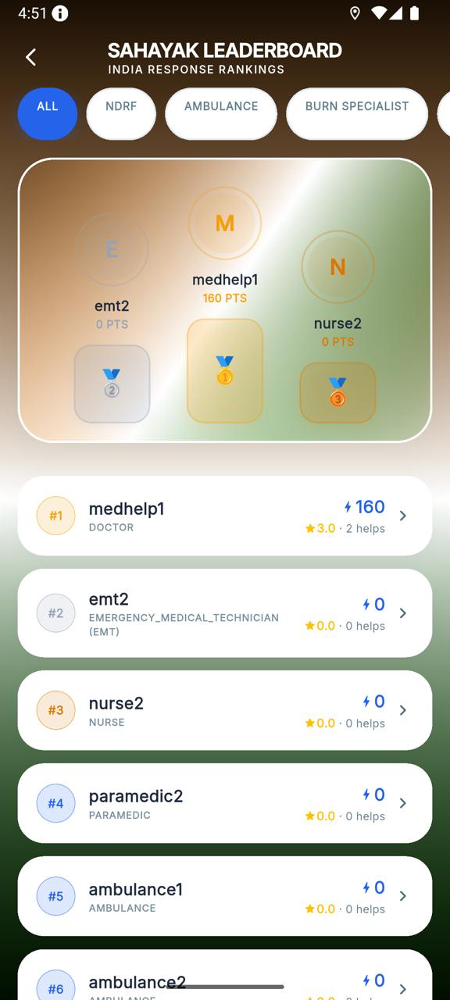
</p>

---

## 🏗️ Tech Stack

### 📱 Frontend
- Flutter (Dart)
- BLoC (State Management)

### ⚙️ Backend
- Supabase (PostgreSQL + Auth + RLS)

### 🌍 Maps & Location
- Google Maps SDK  
- PostGIS (Geo queries)

### 📡 Communication
- SMS (Telephony API)
- Firebase Cloud Messaging (FCM)

### 🤖 Services
- FastAPI (Python microservice)
- Speech-to-Text pipeline

### 🤖 AI & Automation
- FastAPI (Python microservice)
- LangChain (RAG pipeline)
- Self-RAG architecture (context-aware retrieval)
- n8n (workflow orchestration)

### 🔗 Blockchain
- Polygon Amoy (Rescue logging)

---

## 🧠 Key Engineering Highlights

- 🔥 Offline-first architecture (works without internet)
- ⚡ Real-time geo-matching using spatial queries  
- 🎤 Continuous STT with proper lifecycle management  
- 🔄 Background execution handling OS-level constraints  
- 🌐 Flutter ↔ WebGL integration for 3D avatar  

---

## 👨‍💻 Team Routers

**Vikrant Saini**
- Flutter app development (UI + BLoC state management)
- Native Android integration using Kotlin (Method Channels)
- Supabase integration (auth, database, APIs)

**Prathamesh Patil**
- AI pipeline development (LangChain + Self-RAG system)
- Workflow orchestration using n8n
- Blockchain integration (Polygon - rescue logging & trust layer)

**Abhishek Sapkal**
- Repository management & collaboration (GitHub workflows)
- Supabase support & system integration
- Product thinking, research & presentation strategy

---

## 🔐 Security

- Environment-based API key management (`.env`)
- Supabase Row-Level Security (RLS)
- Runtime permission handling (Mic, Location, SMS)

---

## ⚙️ Setup

```bash
git clone https://github.com/HackIndiaXYZ/hackindia-spark-6-ncr-central-region-routers.git
cd hackindia-spark-6-ncr-central-region-routers
flutter pub get